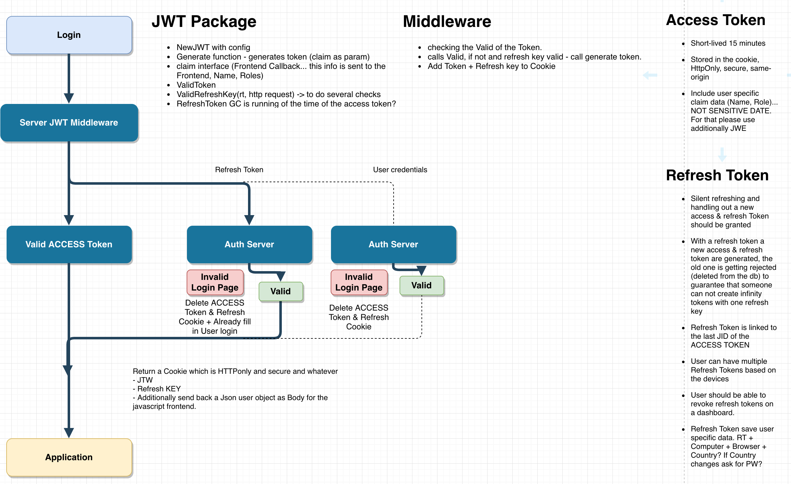

# go-middleware

go-middleware is a minimalistic middleware helper for the normal http.Handler and the httprouter.Handle of julienschmidt.
You can chain multiple middlewares and they get handled in the right order.

## Install

```go
go get github.com/fullhouse-productions/go-middleware
```

## Usage

```go
import "github.com/fullhouse-productions/go-middleware"

mw := New(middleware.A,middleware.B)
mw.Add(middleware.C,middleware.D)
mw.GetAll() // returns all middlewares as a slice
mw.Handle(middleware.E) // A -> B -> C -> D -> E are getting handled

// NewJR for the julienschmidt-router
mw := NewJR(middleware.A,middleware.B)
mw.Add(middleware.C,middleware.D)
mw.GetAll() // returns all middlewares as a slice
mw.Handle(middleware.E) // A -> B -> C -> D -> E are getting handled
```

## New
New is creating a new middleware chain with the given middlewares.

```go
mw := New(middleware.A,middleware.B)
```

## NewJR
NewJR is creating a new middleware chain with the given middlewares for the julienschmidt-router.
That one is requesting a third parameter with the handler.
The function which are available on the middleware chain are the same.

```go
mw := NewJR(middleware.A,middleware.B)
```


## Add
Add one or more middlewares to the existing chain.
```go
mw.Add(middleware.C,middleware.D)
```

## GetAll
Get all middlewares of a chian in a slice of the type `Middleware`
```go
mw.GetAll()
```

## Handle
Handle all middlewares in the order they were added to the chain.

```go
mw.Handle(middleware.E)
```

# Middlewares

## Logger 
Logger is using the `go-logger` package to log the following info into a Console by default. 

> `2019-01-29 15:19:03 INFO logger.go:61 127.0.0.1 GET /path HTTP/1.1" 200 13 32.369µs`

There are two logger middlewares available
`Logger` for the normal http.HandlerFunc `LoggerJR` for the julienschmidt router.


## JWT

JWT is checking the JWT cookie if the token is valid, if not a 401 will return.
It is available for the normal HandleFunc and the julienschmidt router.

If the Token was successfully parsed, the claim will get added to the request context with the constant `ContextName` = "JWT" 

At the moment only HMAC is implemented. 
RSA is following.

!> TODO: securing the cookies




### NewToken

`NewToken`  requires two arguments which are the `Config` and `Claim` struct.
The `Claim` is used later on for parsing the jwt.
The configuration is defining some basic jwt settings ([see Config](middleware?id=config))

Before a new instance is getting created, its checking if the `Config` is valid.

```go
claim := &Claim{}
cfg := &Config{....}
token,err := NewToken(cfg,claim)
```

On a token instance the following functions are available:

**Generate**

The `Generate` function requires one argument which must implement the `Claim` interface. 
The claim can already have some custom claims defined.

The `Jid`, `Iat`, `Nbf`, `Exp`, `Iss`, `Sub` and `Aud` are getting set from the config.

After that, the token will get signed.
Token string, a refresh token (UUID) and error identifier will get returned.

**Parse**

The `Parse` function tries to parse the given token and checks the following secure steps:


 * 1(jwt lib) 3  Segments of the Token (jwt)
 * 2(jwt lib) Token string should not contain bearer (jwt)
 * 3(jwt lib) Header segment decode - ValidationErrorMalformed
 * 4(jwt lib) Claim segment decode - ValidationErrorMalformed
 * 5(jwt lib) Signature segment check if token.header alg is allowed and specified otherwise. ValidationErrorUnverifiable,ValidationErrorUnverifiable
 * 6(jwt lib) signing Methid
 * 7(jwt lib) check if Keyfunc exists
 * 8(jwt lib) call the Claim `Valid` function -- **This will be your Claim.Valid function**
 * 9(jwt lib) Perform validation
 * 10(we) Check if the Claim (Iss, Aud, Sub and Alg) is the same as configured
 * 11(we) Check Exp,Nbf,Iat... we need this because the Valid function of jwt.StandardClaim is can get overwritten.

If all of the points are valid, the token will be parsed and the Claim will get returned.

### RefreshToken

!> The refresh token is getting returned in the `Generate` method. The logic has to get implemented by your own.


### Config

The fields `Alg`, `Issuer`, `Audience`, `Subject`, `AccessDuration` and `SignKey` are mandatory and are not allowed to be empty otherwise the `Config` will not be valid.
The entered `Alg` gets converted to uppercase.
`Alg` at the moment only `HS256`, `HS384` and `HS512` are allowed!

```go
type Config struct{
	Alg      string         //algorithm (HS256, HS384, HS512)
	Issuer   string         //issuer
	Audience string         //audience
	Subject  string         //subject
	AccessDuration time.Duration  //duration how long the access token should be valid (suggested short lived 15 Minutes)
	SignKey  string         //the sign key. atm only a key, later on it can also be a file path
	RefreshToken bool  //true if a refresh token should get created
	RefreshDuration time.Duration  //the ttl of the refresh token. If 0 = infinity (suggested long lived P30DT)
}
```


### Claim
That the claims can be full customized, there is a Claim Interface defined.
The following function has to be implemented in your own Claim.

There is also a `StdClaim` defined which can get embedded to your claim, which already implements this methods.
The `valid` and `render` method can get overwritten if needed.

```go
// Claim interface
type Claim interface {
	SetJid(string)
	Jid() string
	SetIss(string)
	Iss() string
	SetAud(string)
	Aud() string
	SetSub(string)
	Sub() string
	Iat() int64
	SetIat(int64)
	Exp() int64
	SetExp(int64)
	Nbf() int64
	SetNbf(int64)

	Render() interface{}
	Valid() error
}
```

The `Valid` can be used to add some additional security aspects for your claim.

The `Render` function is returning all information which are needed in the frontend. Due the fact that the JWT (will be) saved as
cookie httpOnly, the JWT will no be available in the frontend JS. That the frontend still gets some basic data, this function can be used.


## RBAC

RBAC is offering a Role base access control list. 
It is based on the JWT middleware and checks the request context for the jwt.Claim.

!> TODO rewrite the params logic and move it to the controller part. Only for julienschmidt router. 

It defines a RoleService interface which has to be implemented.
`resource` defines the URL, `action` is the HTTP Method, `claim` is the existing jwt claim
you have to cast the claim in your `Allowed` function to your Claim type.

```go
type RoleService interface {
	Allowed(resource string, action string, claims interface{}) bool
}
```

If there is no request context defined, a `401` will return and exit the handle loop.
If the Allowed function returns false, a `401` will return and exit the handle loop.

### Usage:

```go
yourSerice := &Service{}
rbac := &Rbac{}
rbac.SetRoleSerice(yourSerice)

mw := middleware.New(rbac.Middleware)
```

# Issues & Ideas

To report Issues or to improve this package, please use the github issue board or send a pull request.

https://github.com/fullhouse-productions/go-middleware/issues
